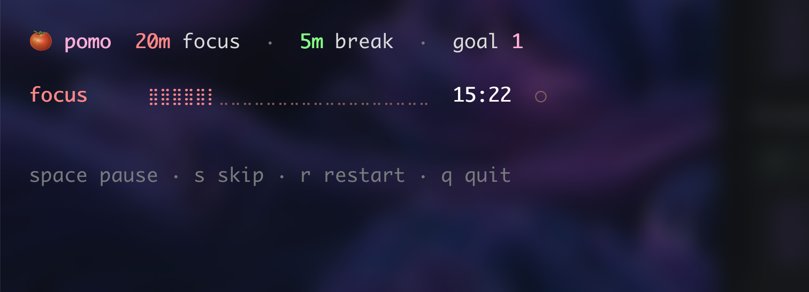
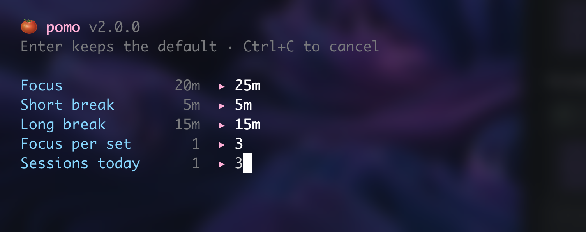

# 🍅 pomo

A minimal pomodoro timer in your terminal. This is an extremely straightforward
little script which does what it says on the tin. Type `pomo` and it shows a
pomodoro timer. At the end of a session it notifies you with a configurable sound.

No websites, no windows, barely any RAM or CPU, no network usage. Just works.



## Install

macOS or Linux, Python 3.9+. No dependencies — one file. Clone it, put it on
your PATH; there's no installer to trust and `git pull` updates the command you
run. (Windows notes are at the very bottom.)

**macOS**

```sh
git clone https://github.com/Starwaves1/pomo.git
mkdir -p ~/bin && ln -s "$PWD/pomo/pomo" ~/bin/pomo
echo 'export PATH="$HOME/bin:$PATH"' >> ~/.zshrc && exec zsh
```

**Linux**

```sh
git clone https://github.com/Starwaves1/pomo.git
mkdir -p ~/.local/bin && ln -s "$PWD/pomo/pomo" ~/.local/bin/pomo
echo 'export PATH="$HOME/.local/bin:$PATH"' >> ~/.bashrc && exec bash
```

Each recipe is three lines: clone it, link it onto your PATH, make sure that
folder is on your PATH. The link (or `git pull`) means updates need no reinstall.

## Use

Start pomo:

```sh
pomo
```



Answer durations as `25`, `45m`, `90s`, or `1h`.

## Hotkeys

| key | |
|---|---|
| `space` | pause / resume |
| `s` | skip to the next interval |
| `r` | restart this interval |
| `q` | quit (Ctrl+C works too) |

Full help, including where settings live:

```sh
pomo help
```

## Settings

`~/.config/pomo/pomo.ini`, rewritten after every run so it always holds your
last session. Setup covers the timings; edit the file for the rest.

The default sound ships with your OS — **`Glass` on macOS**, **`complete` on
Linux** — so it rings on the first run without you installing anything. Point
`file` at your own audio instead whenever you like, or **leave it empty for
silence**:

```ini
[sound]
# A sound that ships with your OS, or a path to any audio file of your own.
# Leave empty for silence.
file = ~/Documents/ping.wav
volume = 0.5

[display]
width = 24
notify = yes
```

Other names that work out of the box:

| | |
|---|---|
| macOS | `Glass` `Ping` `Submarine` `Hero` `Funk` `Sosumi` `Basso` |
| Linux | `complete` `bell` `message` `alarm-clock-elapsed` |
| nothing | `file =` on its own — no sound at all |


## Notes

The same install works on macOS and Linux. The audio player and notifier are
discovered at runtime:

| | macOS | Linux |
|---|---|---|
| sound | `afplay` | `paplay`, `ffplay`, `mpv`, `aplay` |
| notification | `osascript` | `notify-send` |

The first one present wins. On a machine with none of them, pomo runs quiet
instead of failing.

Uses the alternate screen buffer, like `vim` or `htop` — your scrollback is
untouched while it runs, and you get the window back exactly as you left it,
with one line saying what you got done.

## License

MIT

---

## Windows

It runs, but this is the unloved corner: **desktop notifications don't work**
(you still get the sound), and it's **not really tested** — a session or two on
Windows-on-ARM, that's all. macOS and Linux are the supported paths.

In **PowerShell** (not Command Prompt), install the two prerequisites:

```powershell
winget install Python.Python.3.13
winget install Git.Git
```

Close that window, open a fresh one, then paste:

```powershell
git clone https://github.com/Starwaves1/pomo.git "$env:USERPROFILE\pomo-app"
$dir = "$env:USERPROFILE\pomo-app"
Set-Content "$dir\pomo.cmd" "@py `"$dir\pomo`" %*" -Encoding ASCII
[Environment]::SetEnvironmentVariable("Path",
  [Environment]::GetEnvironmentVariable("Path","User") + ";$dir", "User")
$env:Path += ";$dir"
pomo help
```

Then `pomo` works in any new terminal. Use **Windows Terminal** so the
full-screen timer renders.
